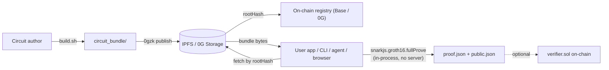

# 0gzk

> **ZK Proof-as-a-Service on decentralized storage — publish Circom circuits once to IPFS or 0G Storage, register them on Base or 0G Chain, prove anything client-side via SDK, CLI, or an AI agent that runs the job for you. Witnesses never leave the device.**

[](https://www.npmjs.com/package/@0gzk/sdk)
[](https://www.npmjs.com/package/@0gzk/cli)
[](./LICENSE)

Circuit authors compile a Circom circuit, run a one-shot trusted setup, and publish the resulting `circuit_bundle/` (wasm + zkey + verification key + verifier contract + metadata) to **IPFS** (the default) or **0G Storage** as a single content-addressed `tar.gz`. The returned `rootHash` is the bundle's content address (on IPFS it is the CIDv0's sha2-256 digest, bijective with the CID). An on-chain `CircuitRegistry` — deployed on **Base** and **0G Chain** (mainnet + testnet on both; same address `0xCe9f…E64d` on Base mainnet, Base Sepolia and 0G mainnet) — maps `name@version` to that hash. Anyone can fetch the bundle back, validate inputs against the circuit's schema, and produce a Groth16 proof locally — in Node, in a browser, via the `0gzk` CLI, or by asking `0gzk agent` in plain English. Optional on-chain verification uses the auto-generated `verifier.sol`.

**The default network is `base`** (chain ID `8453`), which also makes **IPFS the default storage backend**. `0gzk config set network 0g-mainnet` (or `--network 0g-mainnet` / `OGZK_NETWORK=0g-mainnet`) moves the whole stack back to 0G Chain + 0G Storage.

## Architecture



Three SDK surfaces, picked automatically by your runtime:

- **`@0gzk/sdk`** (isomorphic) — `generateProof`, `verifyLocal`, `validateInputs`. Works in Node and in the browser. Wraps `snarkjs.groth16` with metadata-driven input validation.
- **`@0gzk/sdk/node`** (Node-only) — `uploadBundle`, `fetchBundle`, `loadConfig`, `readBundleFromDir`. Routes through pluggable storage backends: 0G Storage (via a lazily-imported `@0gfoundation/0g-ts-sdk`) or any `pinFileToIPFS`-compatible IPFS pinning service.
- **`@0gzk/sdk/onchain`** (isomorphic) — `getRegistryContract`, `getVersion`, `listCircuits`, `resolveBundle`. Resolves `name@version` to a bundle through the on-chain [`CircuitRegistry`](./packages/contracts/src/CircuitRegistry.sol).

## Install

```bash
# Library
npm i @0gzk/sdk snarkjs

# CLI (provides the `0gzk` binary)
npm i -g @0gzk/cli
```

## Use the SDK

```ts
import { generateProof, verifyLocal, type BundleFiles } from "@0gzk/sdk";

const bundle: BundleFiles = {
  wasm,            // Uint8Array of circuit.wasm
  zkey,            // Uint8Array of circuit_final.zkey
  vkey,            // parsed verification_key.json
  metadata,        // parsed metadata.json (CircuitMetadata)
};

const inputs = { birthYear: 1990, currentYear: 2026, minAge: 18 };
const { proof, publicSignals } = await generateProof(bundle, inputs);
const ok = await verifyLocal(bundle, { proof, publicSignals });
```

In Node you can pull the bundle from storage instead of constructing one by hand. `loadConfig()` with nothing set resolves **Base + IPFS**:

```ts
import { fetchBundle, loadConfig } from "@0gzk/sdk/node";

const config = loadConfig({});                        // network: "base", storage: "ipfs"
const bundle = await fetchBundle(rootHash, config, "/tmp/my-bundle");

// Same call against 0G Chain + 0G Storage:
const zeroG = loadConfig({ network: "0g-mainnet" });  // storage flips to "0g"
```

Or skip "what's the rootHash?" entirely and resolve circuits by name from the on-chain registry:

```ts
import { JsonRpcProvider } from "ethers";
import { getRegistryContract, resolveBundle, parseNameSpec } from "@0gzk/sdk/onchain";
import { fetchBundle, loadConfig } from "@0gzk/sdk/node";

// chainId defaults to 8453 (Base mainnet); pass it explicitly on other chains.
const registry = getRegistryContract(new JsonRpcProvider("https://mainnet.base.org"), undefined, 8453);
const { record, bundle } = await resolveBundle(
  registry,
  parseNameSpec("age_verification@0.1.0"),
  (root) => fetchBundle(root, loadConfig({}), `/tmp/0gzk/${root}`),
);
```

Browser, Next.js App Router, registry-driven proving, and CI recipes are all in [`packages/sdk/USAGE.md`](./packages/sdk/USAGE.md).

## Use the CLI

```bash
# One-time setup: store a funded key in ~/.0gzk/config.json (mode 0600) and a
# pinning token for IPFS uploads. The CLI does not read .env files; everything
# lives in the global config store.
0gzk key 0x...                       # shortcut for `0gzk config set privateKey 0x...`
0gzk config set ipfsApiToken eyJ...  # Pinata-style JWT; the only publish credential on Base
0gzk config get                      # show current values + their source

# Publish a circuit bundle. Defaults: pinned to IPFS, registry on Base mainnet.
0gzk publish ./circuit_bundle

# Publish AND register on-chain in one step
0gzk publish ./circuit_bundle --register

# Same flow on Base Sepolia (testnet ETH from any Base Sepolia faucet)
0gzk publish ./circuit_bundle --network base-sepolia --register

# Opt into 0G Chain + 0G Storage instead (needs a funded 0G wallet)
0gzk publish ./circuit_bundle --network 0g-mainnet --register

# Finalization on 0G Storage can take a few minutes. Set a wall-clock budget
# (default 5m). The rootHash is printed the moment it's known, so if the wait
# is exceeded the upload tx is still on chain and you can recover.
0gzk publish ./circuit_bundle --network 0g-mainnet --wait 30m
0gzk publish ./circuit_bundle --network 0g-mainnet --no-wait --register

# Recovery path: register an already-uploaded rootHash without re-uploading.
0gzk registry register 0xabc... --bundle ./circuit_bundle

# Browse registered circuits
0gzk registry list
0gzk registry get age_verification

# Fetch a bundle by root hash, or by name
0gzk fetch 0x5aa4e2... /tmp/0gzk-fetched
0gzk registry resolve age_verification@0.1.0 /tmp/age

# Generate a proof locally - bundle source is exclusive: --bundle, --root-hash, or --name
0gzk prove --bundle    ./circuit_bundle           ./input.json
0gzk prove --root-hash 0x5aa4e2...                ./input.json
0gzk prove --name      age_verification@0.1.0     ./input.json
```

`0gzk prove` writes `proof.json`, `public.json`, and a roll-up `result.json` into `./proof-<timestamp>/`. Outputs are byte-compatible with the canonical `snarkjs` CLI — anyone can verify them with `snarkjs groth16 verify`. Bundles fetched by root hash are cached at `~/.0gzk/bundles/<rootHash>/` for instant reuse (override with `OGZK_CACHE_DIR`).

## Examples

The [`examples/`](./examples) folder ships five standalone reference projects, each installing `@0gzk/sdk` from npm and each documenting a single surface of 0gzk in around 30 - 100 LOC. Pick the one that matches what you're trying to do:

| Example | Audience | What it shows |
| --- | --- | --- |
| [`01-prove-in-node`](./examples/01-prove-in-node) | Node prover | Resolve by name → fetch from 0G Storage → prove → verify, all in one short script. |
| [`02-prove-in-browser`](./examples/02-prove-in-browser) | Browser prover | Vite + vanilla TS. Gunzip + untar in the tab, snarkjs in WASM, witness never leaves the device. |
| [`03-verify-on-chain`](./examples/03-verify-on-chain) | Solidity consumer | Foundry project: hermetic `forge test` + a `SubmitProof.s.sol` recipe for the live path. |
| [`04-resolve-by-name`](./examples/04-resolve-by-name) | Integrator | 25-line "phone book": print every field of a registry record. |
| [`05-publish-your-own`](./examples/05-publish-your-own) | Circuit author | `private_multiply.circom` + self-contained `build.sh` + a prose walkthrough to a registry entry. |

```bash
cd examples/01-prove-in-node
pnpm install --frozen-lockfile --ignore-workspace
pnpm smoke           # node prove.mjs age_verification 1990
```

## AI tooling

Two AI surfaces ship with the repo, both backed by the committed circuit catalog (`circuits/index.json`, regenerated with `0gzk catalog build`):

- **`0gzk agent`** — a terminal agent that **does the job instead of describing it**: it finds the circuit, tells you which signals it needs, asks for the values it doesn't have, validates them, **runs the prover on your machine**, and writes the artifacts to disk.

  ```bash
  0gzk agent "Prove that I am over 18. I was born in 1990, the current year is 2026. Save the proof to /tmp/agent-proof"
  # ⏺ search_circuits(…)                    ← server-side
  # ⏺ validate_inputs(…)          · local   ← your machine
  # ⏺ prove_circuit(…, outDir)    · local   ← your machine
  # verified: true · publicSignals ["1","2026","18"] · /tmp/agent-proof/{proof,public,result}.json
  ```

  **No API key needed**: the conversation runs through the hosted 0gzk backend (gpt-5-nano + the read-only discovery tools, server-side). The three tools that touch your files or your witness — `validate_inputs`, `read_input_file`, `prove_circuit` — are declared to the model but **executed by your CLI**, so private inputs never reach the server. Circuit authors can pass `--local` to run the Claude Agent SDK in-process with the full authoring toolset (scaffold → build → prove), using their own Anthropic key or Claude Code login. Details: [docs → AI agent](./docs/content/agent.mdx).
- **[`@0gzk/mcp`](./packages/mcp)** — an MCP server exposing **11 tools in a repo checkout, 8 anywhere else**: circuit search over names/tags/use-cases, live-registry listing and resolution on every supported chain, input-schema validation, local input files, proof generation, plus authoring helpers (scaffold, validate metadata, build). `claude mcp add 0gzk -- npx -y @0gzk/mcp` wires it into Claude Code; this repo also ships a pre-wired [`.mcp.json`](./.mcp.json). Cursor and Claude Desktop configs are in the [package README](./packages/mcp/README.md).

## Repository layout

This is a `pnpm` workspaces monorepo:

| Path                  | What                                                                                                |
| --------------------- | --------------------------------------------------------------------------------------------------- |
| `packages/sdk/`       | [`@0gzk/sdk`](./packages/sdk) — isomorphic prover, storage backends (0G Storage / IPFS), on-chain registry client |
| `packages/cli/`       | [`@0gzk/cli`](./packages/cli) — the `0gzk` binary: publish, prove, registry, catalog, agent         |
| `packages/mcp/`       | [`@0gzk/mcp`](./packages/mcp) — MCP server for circuit discovery + authoring                        |
| `packages/contracts/` | Foundry project for [`CircuitRegistry`](./packages/contracts/src/CircuitRegistry.sol) and verifiers |
| `circuits/`           | Reference circuits + [catalog](./circuits/README.md) (`index.json`, `publications.json`)            |
| `web/`                | [Next.js 16 web prover](./web) — workspace member consuming `@0gzk/sdk`                             |
| `docs/`               | [Nextra docs site](./docs) — installs standalone with `pnpm install --ignore-workspace`             |
| `examples/`           | Five standalone reference projects installing the published SDK from npm                            |

## Develop from source

### Prerequisites

- Node.js 20+
- pnpm 9+ (`npm i -g pnpm`)
- [`circom`](https://docs.circom.io/getting-started/installation/) compiler (Rust binary; not on npm)
- bash — required for `circuits/*/build.sh`. On Windows use **git-bash** or **WSL**.

### Build

```bash
pnpm install
pnpm -r build
```

### Build the reference circuit

```bash
cd circuits/age_verification
bash build.sh
```

This compiles `age_verification.circom`, downloads the Powers of Tau (with blake2b integrity check), runs the snarkjs trusted setup, and emits a self-contained `circuit_bundle/` (wasm + zkey + verification key + Solidity verifier + metadata).

### End-to-end smoke test

```bash
# Local prove against the bundle you just built
node packages/cli/dist/index.js prove \
  --bundle circuits/age_verification/circuit_bundle \
  circuits/age_verification/example_input.json
# -> proof-<timestamp>/, "verified": true, publicSignals: ["1","2026","18"]
```

## Network configuration

The Node surface and the CLI default to **Base mainnet** (`base`, chain ID **8453**) — a breaking change from the previous `0g-mainnet` default. Four networks are supported, all four with a live `CircuitRegistry` baked into the SDK:

| Network       | Chain ID | RPC                          | Explorer                      | `CircuitRegistry`                            |
| ------------- | -------: | ---------------------------- | ----------------------------- | -------------------------------------------- |
| `base` **(default)** | `8453`   | `https://mainnet.base.org`     | `https://basescan.org`            | `0xCe9f0DF51abeC7B8cD751067c6D8d3db5E2bE64d` |
| `base-sepolia`| `84532`  | `https://sepolia.base.org`     | `https://sepolia.basescan.org`    | `0xCe9f0DF51abeC7B8cD751067c6D8d3db5E2bE64d` |
| `0g-mainnet`  | `16661`  | `https://evmrpc.0g.ai`         | `https://chainscan.0g.ai`         | `0xCe9f0DF51abeC7B8cD751067c6D8d3db5E2bE64d` |
| `0g-testnet`  | `16602`  | `https://evmrpc-testnet.0g.ai` | `https://chainscan-galileo.0g.ai` | `0x5b2c3e86c9255a4459199a6d9cb7b63e2a660ce6` |

The deprecated aliases `mainnet` → `0g-mainnet` and `testnet` → `0g-testnet` are still accepted everywhere; unknown network names error (listing the valid values) instead of silently defaulting. All 14 reference circuits are published on `base` and `base-sepolia` (bundles on IPFS); the earlier 0G publications stay live on `0g-mainnet` / `0g-testnet` (bundles on 0G Storage).

Bundle storage is a separate choice from the registry chain, but it follows the chain family by default: Base chains use the **IPFS** backend (a `pinFileToIPFS`-compatible token like a Pinata JWT is all publishing needs — no 0G wallet), 0G chains use the **0G Storage** backend (funded 0G wallet required to publish). Since `base` is the default network, **`ipfs` is the default backend**. Fetching needs neither credential.

For the **CLI**, persist values once with `0gzk config set <key> <value>` (writes `~/.0gzk/config.json` with mode `0600`). The CLI does **not** read `.env` files. For programmatic use of `@0gzk/sdk` from a Node app, the same values are read from environment variables — the generic `OGZK_*` names are preferred, the legacy `OG_*` names still work.

| `0gzk config` key | Env var (legacy)                        | Default                                  | Purpose                                       |
| ----------------- | --------------------------------------- | ---------------------------------------- | --------------------------------------------- |
| `network`         | `OGZK_NETWORK` (`OG_NETWORK`)           | `base`                                   | One of the four networks above (or an alias)  |
| `privateKey`      | `OGZK_PRIVATE_KEY` (`OG_PRIVATE_KEY`)   | —                                        | Funded `0x...` key for uploads/registrations  |
| `rpcUrl`          | `OGZK_RPC_URL` (`OG_RPC_URL`)           | preset RPC                               | EVM RPC override                              |
| `indexerUrl`      | `OG_INDEXER_URL`                        | preset indexer                           | 0G Storage indexer override (0g backend)      |
| `registry`        | `OGZK_REGISTRY_ADDRESS`                 | baked-in per chain                       | `CircuitRegistry` address override            |
| `storage`         | `OGZK_STORAGE`                          | `ipfs` on Base, `0g` on 0G chains        | Bundle storage backend: `0g` or `ipfs`        |
| `storageNetwork`  | `OGZK_STORAGE_NETWORK`                  | selected 0G network, else `0g-mainnet`   | 0G chain the `0g` backend signs uploads on    |
| `ipfsApiUrl`      | `OGZK_IPFS_API_URL`                     | Pinata's `pinFileToIPFS` endpoint        | Any `pinFileToIPFS`-compatible upload API     |
| `ipfsApiToken`    | `OGZK_IPFS_API_TOKEN`                   | —                                        | Bearer token for the pinning API (masked)     |
| `ipfsGateway`     | `OGZK_IPFS_GATEWAY`                     | `https://gateway.pinata.cloud`           | HTTP gateway for IPFS fetches (with fallbacks)|
| `anthropicApiKey` | `ANTHROPIC_API_KEY`                     | —                                        | Auth for `0gzk agent --local` (masked)        |
| `agentUrl`        | `OGZK_AGENT_URL`                        | `https://0gzk.com/api/agent`             | Hosted `0gzk agent` endpoint                  |
| —                 | `OGZK_CACHE_DIR`                        | `~/.0gzk/bundles`                        | Where `0gzk prove --root-hash` caches bundles |

Resolution priority for the CLI: CLI flag > shell env > `~/.0gzk/config.json` > built-in network preset. Downloads (`fetch`, remote `prove`) do not require a wallet.

### Choosing a network

**Base mainnet** — the default; nothing to configure. Registry on Base, bundles pinned to IPFS, no 0G wallet anywhere:

```bash
0gzk config set ipfsApiToken eyJ...      # Pinata-style JWT; the only publish credential
0gzk key 0x...                            # funded with Base ETH for the registration tx
0gzk publish ./circuit_bundle --register  # --network base is implied
0gzk prove --name age_verification ./input.json
```

The record's `metadataURI` carries the bundle's `ipfs://` URI, so fetch-by-name routes to an IPFS gateway automatically. **Base Sepolia** is the same flow with `--network base-sepolia` / `OGZK_NETWORK=base-sepolia` and faucet ETH.

**0G mainnet** — the switch back from the Base default; registry on 0G Chain, bundles on 0G Storage:

```bash
0gzk config set network 0g-mainnet
# Defaults flip to:
#   RPC:     https://evmrpc.0g.ai
#   Indexer: https://indexer-storage-turbo.0g.ai
#   Chain:   16661
#   Storage: 0g  (a funded 0G wallet is required to publish)
```

**0G Galileo testnet** — same stack, free gas from the [official faucet](https://faucet.0g.ai):

```bash
0gzk config set network 0g-testnet
# RPC https://evmrpc-testnet.0g.ai · indexer https://indexer-storage-testnet-turbo.0g.ai · chain 16602
```

The Galileo `CircuitRegistry` is at [`0x5b2c3e86c9255a4459199a6d9cb7b63e2a660ce6`](https://chainscan-galileo.0g.ai/address/0x5b2c3e86c9255a4459199a6d9cb7b63e2a660ce6); the other three chains share `0xCe9f…E64d`.

Registry chain and storage backend are independent, so registering on Base while keeping bundles on 0G Storage also works (`--storage 0g`) — that split needs gas on both chains. Full details in [docs → Networks & storage](./docs/content/networks.mdx).

## Roadmap

- [x] Monorepo scaffolding (pnpm workspaces, strict TypeScript, shared base config)
- [x] Reference circuit `age_verification` with one-shot reproducible `build.sh`
- [x] 0G Storage round-trip: `0gzk publish` and `0gzk fetch` with on-chain receipt
- [x] Prover engine: snarkjs Groth16 with metadata-driven input validation, bundle disk cache
- [x] `@0gzk/sdk` and `@0gzk/cli` published to npm (v0.1.x)
- [x] Next.js web app: pick a circuit by root hash, prove in-browser, witness never leaves the tab
- [x] On-chain circuit registry (`CircuitRegistry.sol`) + `@0gzk/sdk/onchain` client (v0.2)
- [x] More reference circuits: `poseidon_preimage`, `merkle_membership`, `private_balance_threshold` (v0.2)
- [x] Vitest test suite for `@0gzk/sdk`: unit + fixture integration + gated live e2e (v0.2)
- [x] Multi-chain: IPFS storage backend + `CircuitRegistry` on Base mainnet and Base Sepolia, with `base` as the default network (v0.4)
- [x] `0gzk agent` and `@0gzk/mcp`: an agent that generates the proof itself, with the witness-touching tools executed on the user's machine (v0.4)
- [ ] On-chain Groth16 verification helper in `@0gzk/sdk/onchain` (after first verifier-attached deploy)
- [ ] Marketplace UI surfacing community-published circuits
- [ ] Distributed trusted-setup ceremonies via 0G Compute (v0.3)

See [CHANGELOG.md](./CHANGELOG.md) and [TODO.md](./TODO.md) for release notes and the active backlog.

## Why decentralized storage

Circuit artifacts (wasm + zkey) are megabytes — too expensive to host on Ethereum and too central to put on a single CDN. Both backends are decentralized and content-addressed: **IPFS** (the default) needs nothing but a public gateway to read and a pinning token to write, and **0G Storage** is DA-optimized and cheap enough to host hundreds of circuits at platform scale. Either way the `rootHash` is portable — any client can pull a verified copy and check it against the registry's `vkeyHash`.

## Why client-side proving

Witness data (the private inputs to the proof) must never leave the prover's machine — that's the whole point of zero knowledge. `snarkjs.groth16.fullProve` runs everywhere Node and modern browsers run, so the SDK ships exactly that path: bundle bytes in, `proof + publicSignals` out. No proving server, no trust delegation, no leak surface.

## License

[MIT](./LICENSE) — see also the per-package licenses inside `packages/sdk/` and `packages/cli/`.
