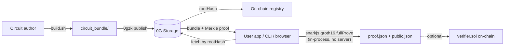

# 0gzk

> **ZK Proof-as-a-Service on 0G Storage — publish Circom circuits once, prove anything client-side via SDK or CLI. Witnesses never leave the device.**

[](https://www.npmjs.com/package/@0gzk/sdk)
[](https://www.npmjs.com/package/@0gzk/cli)
[](./LICENSE)

Circuit authors compile a Circom circuit, run a one-shot trusted setup, and publish the resulting `circuit_bundle/` (wasm + zkey + verification key + verifier contract + metadata) to **0G Storage** as a single content-addressed `tar.gz`. The returned `rootHash` is the bundle's CID. Anyone can fetch it back, validate inputs against the circuit's schema, and produce a Groth16 proof locally — in Node, in a browser, or via the `0gzk` CLI. Optional on-chain verification uses the auto-generated `verifier.sol`.

## Architecture



Three SDK surfaces, picked automatically by your runtime:

- **`@0gzk/sdk`** (isomorphic) — `generateProof`, `verifyLocal`, `validateInputs`. Works in Node and in the browser. Wraps `snarkjs.groth16` with metadata-driven input validation.
- **`@0gzk/sdk/node`** (Node-only) — `uploadBundle`, `fetchBundle`, `loadConfig`, `readBundleFromDir`. Talks to 0G Storage via `@0gfoundation/0g-ts-sdk`.
- **`@0gzk/sdk/onchain`** (isomorphic) — `getRegistryContract`, `getVersion`, `listCircuits`, `resolveBundle`. Resolves `name@version` to a bundle through the on-chain [`CircuitRegistry`](./packages/contracts/src/CircuitRegistry.sol).

## Install

```bash
# Library
npm i @0gzk/sdk snarkjs

# CLI (provides the `0gzk` binary)
npm i -g @0gzk/cli
```

## Use the SDK

```ts
import { generateProof, verifyLocal, type BundleFiles } from "@0gzk/sdk";

const bundle: BundleFiles = {
  wasm,            // Uint8Array of circuit.wasm
  zkey,            // Uint8Array of circuit_final.zkey
  vkey,            // parsed verification_key.json
  metadata,        // parsed metadata.json (CircuitMetadata)
};

const inputs = { birthYear: 1990, currentYear: 2026, minAge: 18 };
const { proof, publicSignals } = await generateProof(bundle, inputs);
const ok = await verifyLocal(bundle, { proof, publicSignals });
```

In Node you can pull the bundle off 0G Storage instead of constructing one by hand:

```ts
import { fetchBundle, loadConfig } from "@0gzk/sdk/node";

const config = loadConfig({});
const bundle = await fetchBundle(rootHash, config, "/tmp/my-bundle");
```

Or skip "what's the rootHash?" entirely and resolve circuits by name from the on-chain registry:

```ts
import { JsonRpcProvider } from "ethers";
import { getRegistryContract, resolveBundle, parseNameSpec } from "@0gzk/sdk/onchain";
import { fetchBundle, loadConfig } from "@0gzk/sdk/node";

const registry = getRegistryContract(new JsonRpcProvider("https://evmrpc.0g.ai"));
const { record, bundle } = await resolveBundle(
  registry,
  parseNameSpec("age_verification@0.1.0"),
  (root) => fetchBundle(root, loadConfig({}), `/tmp/0gzk/${root}`),
);
```

Browser, Next.js App Router, registry-driven proving, and CI recipes are all in [`packages/sdk/USAGE.md`](./packages/sdk/USAGE.md).

## Use the CLI

```bash
# One-time setup: store a funded mainnet key in ~/.0gzk/config.json (mode 0600).
# The CLI does not read .env files; everything lives in the global config store.
0gzk key 0x...                   # shortcut for `0gzk config set privateKey 0x...`
0gzk config get                  # show current values + their source

# Publish a circuit bundle to 0G Storage
0gzk publish ./circuit_bundle

# Publish AND register on-chain in one step
0gzk publish ./circuit_bundle --register

# Finalization on 0G Storage can take a few minutes. Set a wall-clock budget
# (default 5m). The rootHash is printed the moment it's known, so if the wait
# is exceeded the upload tx is still on chain and you can recover.
0gzk publish ./circuit_bundle --wait 30m
0gzk publish ./circuit_bundle --no-wait --register   # return as soon as rootHash is known

# Recovery path: register an already-uploaded rootHash without re-uploading.
0gzk registry register 0xabc... --bundle ./circuit_bundle

# Browse registered circuits
0gzk registry list
0gzk registry get age_verification

# Fetch a bundle by root hash, or by name
0gzk fetch 0x5aa4e2... /tmp/0gzk-fetched
0gzk registry resolve age_verification@0.1.0 /tmp/age

# Generate a proof locally - bundle source is exclusive: --bundle, --root-hash, or --name
0gzk prove --bundle    ./circuit_bundle           ./input.json
0gzk prove --root-hash 0x5aa4e2...                ./input.json
0gzk prove --name      age_verification@0.1.0     ./input.json
```

`0gzk prove` writes `proof.json`, `public.json`, and a roll-up `result.json` into `./proof-<timestamp>/`. Outputs are byte-compatible with the canonical `snarkjs` CLI — anyone can verify them with `snarkjs groth16 verify`. Bundles fetched by root hash are cached at `~/.0gzk/bundles/<rootHash>/` for instant reuse (override with `OGZK_CACHE_DIR`).

## Examples

The [`examples/`](./examples) folder ships five standalone reference projects, each installing `@0gzk/sdk` from npm and each documenting a single surface of 0gzk in around 30 - 100 LOC. Pick the one that matches what you're trying to do:

| Example | Audience | What it shows |
| --- | --- | --- |
| [`01-prove-in-node`](./examples/01-prove-in-node) | Node prover | Resolve by name → fetch from 0G Storage → prove → verify, all in one short script. |
| [`02-prove-in-browser`](./examples/02-prove-in-browser) | Browser prover | Vite + vanilla TS. Gunzip + untar in the tab, snarkjs in WASM, witness never leaves the device. |
| [`03-verify-on-chain`](./examples/03-verify-on-chain) | Solidity consumer | Foundry project: hermetic `forge test` + a `SubmitProof.s.sol` recipe for the live path. |
| [`04-resolve-by-name`](./examples/04-resolve-by-name) | Integrator | 25-line "phone book": print every field of a registry record. |
| [`05-publish-your-own`](./examples/05-publish-your-own) | Circuit author | `private_multiply.circom` + self-contained `build.sh` + a prose walkthrough to a registry entry. |

```bash
cd examples/01-prove-in-node
pnpm install --frozen-lockfile --ignore-workspace
pnpm smoke           # node prove.mjs age_verification 1990
```

## Repository layout

This is a `pnpm` workspaces monorepo:

| Path                  | What                                                                                                |
| --------------------- | --------------------------------------------------------------------------------------------------- |
| `packages/sdk/`       | [`@0gzk/sdk`](./packages/sdk) — isomorphic prover, Node 0G Storage helpers, on-chain registry client |
| `packages/cli/`       | [`@0gzk/cli`](./packages/cli) — the `0gzk` binary, registry-aware                                   |
| `packages/contracts/` | Foundry project for [`CircuitRegistry`](./packages/contracts/src/CircuitRegistry.sol) and verifiers |
| `circuits/`           | Reference circuits (`age_verification`, `poseidon_preimage`, `merkle_membership`, …)                |
| `web/`                | [Next.js 16 web prover](./web) — consumes `@0gzk/sdk` from npm                                      |

## Develop from source

### Prerequisites

- Node.js 20+
- pnpm 9+ (`npm i -g pnpm`)
- [`circom`](https://docs.circom.io/getting-started/installation/) compiler (Rust binary; not on npm)
- bash — required for `circuits/*/build.sh`. On Windows use **git-bash** or **WSL**.

### Build

```bash
pnpm install
pnpm -r build
```

### Build the reference circuit

```bash
cd circuits/age_verification
bash build.sh
```

This compiles `age_verification.circom`, downloads the Powers of Tau (with blake2b integrity check), runs the snarkjs trusted setup, and emits a self-contained `circuit_bundle/` (wasm + zkey + verification key + Solidity verifier + metadata).

### End-to-end smoke test

```bash
# Local prove against the bundle you just built
node packages/cli/dist/index.js prove \
  --bundle circuits/age_verification/circuit_bundle \
  circuits/age_verification/example_input.json
# -> proof-<timestamp>/, "verified": true, publicSignals: ["1","2026","18"]
```

## Network configuration

The Node surface and the CLI default to **0G mainnet** (chain ID **16661**).

For the **CLI**, persist values once with `0gzk config set <key> <value>` (writes `~/.0gzk/config.json` with mode `0600`). The CLI does **not** read `.env` files. For programmatic use of `@0gzk/sdk` from a Node app, the same values are read from environment variables.

| `0gzk config` key | Env var                  | Default                                  | Purpose                                       |
| ----------------- | ------------------------ | ---------------------------------------- | --------------------------------------------- |
| `network`         | `OG_NETWORK`             | `mainnet`                                | `mainnet` or `testnet` (Galileo)              |
| `privateKey`      | `OG_PRIVATE_KEY`         | —                                        | Funded `0x...` key, required for `publish`    |
| `rpcUrl`          | `OG_RPC_URL`             | `https://evmrpc.0g.ai`                   | EVM RPC override                              |
| `indexerUrl`      | `OG_INDEXER_URL`         | `https://indexer-storage-turbo.0g.ai`    | 0G Storage indexer override                   |
| `registry`        | `OGZK_REGISTRY_ADDRESS`  | baked-in mainnet address                 | `CircuitRegistry` address override            |
| —                 | `OGZK_CACHE_DIR`         | `~/.0gzk/bundles`                        | Where `0gzk prove --root-hash` caches bundles |

Resolution priority for the CLI: CLI flag > shell env > `~/.0gzk/config.json` > built-in network preset. Downloads (`fetch`, remote `prove`) do not require a wallet.

### Use Galileo testnet instead

```bash
0gzk config set network testnet
# Defaults flip to:
#   RPC:     https://evmrpc-testnet.0g.ai
#   Indexer: https://indexer-storage-testnet-turbo.0g.ai
#   Chain:   16602 (Galileo)
```

Get testnet 0G from the [official faucet](https://faucet.0g.ai). The Galileo `CircuitRegistry` is at [`0x5b2c3e86c9255a4459199a6d9cb7b63e2a660ce6`](https://chainscan-galileo.0g.ai/address/0x5b2c3e86c9255a4459199a6d9cb7b63e2a660ce6).

## Roadmap

- [x] Monorepo scaffolding (pnpm workspaces, strict TypeScript, shared base config)
- [x] Reference circuit `age_verification` with one-shot reproducible `build.sh`
- [x] 0G Storage round-trip: `0gzk publish` and `0gzk fetch` with on-chain receipt
- [x] Prover engine: snarkjs Groth16 with metadata-driven input validation, bundle disk cache
- [x] `@0gzk/sdk` and `@0gzk/cli` published to npm (v0.1.x)
- [x] Next.js web app: pick a circuit by root hash, prove in-browser, witness never leaves the tab
- [x] On-chain circuit registry (`CircuitRegistry.sol`) + `@0gzk/sdk/onchain` client (v0.2)
- [x] More reference circuits: `poseidon_preimage`, `merkle_membership`, `private_balance_threshold` (v0.2)
- [x] Vitest test suite for `@0gzk/sdk`: unit + fixture integration + gated live e2e (v0.2)
- [ ] On-chain Groth16 verification helper in `@0gzk/sdk/onchain` (after first verifier-attached deploy)
- [ ] Marketplace UI surfacing community-published circuits
- [ ] Distributed trusted-setup ceremonies via 0G Compute (v0.3)

See [CHANGELOG.md](./CHANGELOG.md) and [TODO.md](./TODO.md) for release notes and the active backlog.

## Why 0G Storage

Circuit artifacts (wasm + zkey) are megabytes — too expensive to host on Ethereum and too central to put on a single CDN. 0G Storage is decentralized, content-addressed, DA-optimized, and cheap enough to host hundreds of circuits at platform scale. The `rootHash` is portable: any client with the indexer URL can pull a verified copy.

## Why client-side proving

Witness data (the private inputs to the proof) must never leave the prover's machine — that's the whole point of zero knowledge. `snarkjs.groth16.fullProve` runs everywhere Node and modern browsers run, so the SDK ships exactly that path: bundle bytes in, `proof + publicSignals` out. No proving server, no trust delegation, no leak surface.

## License

[MIT](./LICENSE) — see also the per-package licenses inside `packages/sdk/` and `packages/cli/`.
