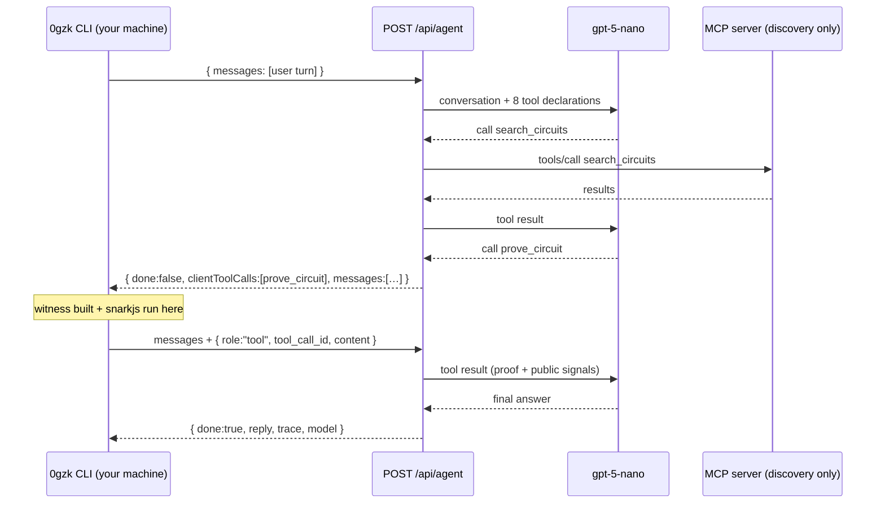

# AI agent

**`0gzk agent`** does the job, it does not hand you instructions. Describe what you want to prove and it finds the circuit, tells you which signals it needs, asks for the values it does not have, checks them against the schema, **runs the prover on your machine**, and writes `proof.json` / `public.json` / `result.json` to disk. The default mode needs **no API key at all**: the conversation goes to the hosted 0gzk backend, which runs `gpt-5-nano` with the read-only discovery tools from the [MCP server](/mcp); everything that touches your files or your witness runs locally in the CLI.

```bash
# One-shot: this really does produce a verified proof
0gzk agent "Prove that I am over 18. I was born in 1990, the current year is 2026. Save the proof to /tmp/agent-proof"

# Interactive chat (exit/quit or Ctrl+D to leave)
0gzk agent
```

## A real session

```
$ 0gzk agent "Prove that I am over 18. I was born in 1990, the current year is 2026. Save the proof to /tmp/agent-proof"

╭── ✳ 0gzk agent ────────────────────────────────────────────╮
│ Find a circuit, hand me your values, get a proof.          │
│                                                            │
│ model    gpt-5-nano  hosted, no API key                    │
│ network  base  registry + bundles                          │
│ proving  on this machine  witness never uploaded           │
│ server   0gzk.com                                          │
╰────────────────────────────────────────────────────────────╯

❯ Prove that I am over 18. I was born in 1990, the current year is 2026. Save the proof to /tmp/agent-proof

⏺ search_circuits({"query":"prove age over 18"})
  ⎿ {"searchMode":"catalog","query":"prove age over 18","results":[{"name":"age_verification"…

⏺ validate_inputs({"name":"age_verification","inputs":{"birthYear":1990,"currentYear":2026,… · local
  ⎿ {"circuit":"age_verification","valid":true,"errors":[],"schema":{"inputs":[{"name":"birt…

⏺ prove_circuit({"name":"age_verification","inputs":{…},"outDir":"/tmp/agent-proof"}) · local
  ⎿ {"circuit":"age_verification","version":"0.1.0","publicSignals":["1","2026","18"],"verif…

Done — proof generated and verified locally.

  circuit        age_verification@0.1.0 (groth16 / bn128)
  publicSignals  ["1","2026","18"]  → isAdult=1, currentYear=2026, minAge=18
  verified       true
  saved          /tmp/agent-proof/{proof.json,public.json,result.json}

birthYear stayed on this machine — only the proof and the three public
signals above ever left it.

────────────────────────────────────────
gpt-5-nano · 11.4s
```

Reading the trace:

- **`⏺ search_circuits`** (green, no suffix) ran **on the server**, over MCP, against the bundled catalog. No private data is involved in "which circuit proves age?".
- **`⏺ … · local`** (cyan) ran **in your CLI process**. The server asked for it and waited; `validate_inputs` checked `birthYear` / `currentYear` / `minAge` against the circuit's declared schema, and `prove_circuit` ran snarkjs in-process.
- The final block is the model's own report, written from the tool results it got back.

When values are missing, the agent asks for them instead of guessing:

```
❯ prove I'm old enough to buy alcohol in Germany

⏺ search_circuits({"query":"prove age over 18"})
  ⎿ {"searchMode":"catalog","query":"prove age over 18","results":[{"name":"age_verification"…

⏺ validate_inputs({"name":"age_verification"}) · local
  ⎿ {"circuit":"age_verification","valid":false,"errors":["no inputs supplied"],"missing":["b…

age_verification needs three values:

  birthYear    uint, private — stays on your machine
  currentYear  uint, public
  minAge       uint, public  (18 for Germany)

Give me your birth year and I'll run it.
```

`validate_inputs` with no `inputs` is the schema probe: it returns `{valid:false, errors:["no inputs supplied"], missing:[…], schema:{…}}`, which is how the agent knows what to ask for without downloading a bundle.

## Where each tool runs

This is the part that matters. The hosted backend **declares** all eight tools to the model, but only executes five of them. The three that touch your machine are handed back to the CLI.

| Tool | Executes | Why |
| --- | --- | --- |
| `search_circuits` | **server** (MCP) | Catalog/registry search; no private data |
| `list_circuits` | **server** (MCP) | Catalog or live registry paging |
| `get_circuit` | **server** (MCP) | Metadata, I/O schema, publications |
| `get_example_input` | **server** (MCP) | Committed `example_input.json` |
| `resolve_circuit` | **server** (MCP) | `name[@version]` → per-chain registry records |
| `validate_inputs` | **client** (your CLI) | Sees your candidate values |
| `read_input_file` | **client** (your CLI) | Reads a JSON file off your disk |
| `prove_circuit` | **client** (your CLI) | Builds the witness and runs snarkjs |

In `--local` mode the split disappears — everything runs in your process, plus the authoring tools (see below).

## The privacy guarantee

Proving is client-side by construction, and the agent loop is built so that staying client-side is not a promise but a mechanic: the code that would need your witness **does not exist on the server**.



What that buys you, concretely:

- **Private inputs are never sent.** The values you type reach `validate_inputs` and `prove_circuit` inside your own process. What travels back to the server is each tool's textual result — capped at 8,000 characters by the CLI.
- **`read_input_file` returns shape, not content.** Point the agent at `./secrets.json` and it gets back `{"path":"…","signals":[{"name":"birthYear","type":"number"}],"note":"values withheld by design; pass this path as inputFile"}`. To prove from that file the model passes `inputFile: "./secrets.json"` to `prove_circuit`, which reads it locally — the values never enter the conversation at all.
- **Validation errors name signals, not values.** `InputValidationError` messages list the offending signal and its expected type; they never echo what you supplied.
- **What does leave** is the Groth16 proof and the public signals — which are public by definition — plus the circuit name and timings.

The authoring tools (`scaffold_circuit`, `build_circuit`, `validate_metadata`) are not declared to the hosted agent at all: they write to disk and are never reachable from a public endpoint.

## Artifacts

`prove_circuit` always writes its artifacts. With no `outDir` they go to **`~/.0gzk/proofs/<circuit>-<timestamp>/`** (override the root with `OGZK_PROOFS_DIR`); an explicit `outDir` is used as given, resolving relative paths against the current directory. The directory is created if missing, and the tool returns the **absolute** path as `saved.outDir` — which the agent quotes back to you verbatim, so you never have to guess where a proof landed.

| File | Content |
| --- | --- |
| `proof.json` | Raw snarkjs `Groth16Proof` |
| `public.json` | `string[]` of public signals |
| `result.json` | Summary: `circuit` (`name`, `version`, `protocol`, `curve`), `publicSignals`, `proof`, `verified`, `durationMs` |

These are byte-compatible with the standalone `snarkjs` CLI, so `snarkjs groth16 verify verification_key.json public.json proof.json` verifies them, and so does the generated `verifier.sol` on-chain.

`prove_circuit` also accepts **`inputFile`** instead of inline `inputs`, and selects a bundle with exactly one of `name` (repo `circuit_bundle/` first, registry fallback), `bundleDir`, or `rootHash`. Its `chain` defaults to **`base`**.

## Hosted backend

The default endpoint is `https://0gzk.com/api/agent` — the `POST /api/agent` route of the 0gzk web app. That route is itself an **MCP client**: it connects to the same [`@0gzk/mcp`](/mcp) server the `0gzk-mcp` binary serves over stdio (here over an in-memory transport) and drives it with `tools/list` / `tools/call`. The protocol path your editor uses is the one the hosted agent exercises on every request.

The endpoint is **stateless**. The server echoes the conversation back as `messages`, and the CLI replays it on the next request with the local tool results appended as `{role:"tool", tool_call_id, content}` entries:

```jsonc
// Not finished: run these locally, then post `messages` + tool results back.
{
  "done": false,
  "reply": "",
  "trace": [{ "tool": "search_circuits", "args": "…", "summary": "…" }],
  "model": "gpt-5-nano",
  "clientToolCalls": [
    { "id": "call_2", "name": "prove_circuit", "arguments": "{\"name\":\"age_verification\",…}" }
  ],
  "messages": [ /* conversation so far, system prompt stripped */ ]
}

// Finished: render the reply.
{ "done": true, "reply": "Done — proof generated…", "trace": [], "model": "gpt-5-nano" }
```

Request validation accepts **user, assistant (including `tool_calls`) and tool turns**, and a request must end with either a user turn or the results of client-side tool calls. Limits: 80 messages, 4,000 chars per user/assistant message, 20,000 chars per tool result, 8 tool calls per assistant turn. The server's per-request tool-round budget is 6; the CLI stops after 8 client/server round trips within one user turn.

Self-hosters set one server-side env var (`OPENAI_API_KEY`; optional `OGZK_AGENT_MODEL` and `OPENAI_BASE_URL` for OpenAI-compatible providers) and point CLIs at their deployment:

```bash
0gzk config set agentUrl https://your-deployment/api/agent   # or OGZK_AGENT_URL
```

## Local mode (circuit authors)

`0gzk agent --local` runs the [Claude Agent SDK](https://docs.claude.com/en/api/agent-sdk/overview) in-process instead, with the **full toolset** — the eight tools above plus the authoring ones (`scaffold_circuit` → you write the constraints → `build_circuit` → `prove_circuit`) and read-only file access. That is **11 tools inside a repo checkout**, 8 anywhere else. Nothing is delegated, because nothing is remote. This mode brings your own model:

```bash
npm install -g @anthropic-ai/claude-agent-sdk   # optional dep, alongside @0gzk/cli
0gzk config set anthropicApiKey sk-ant-...      # or rely on your Claude Code login
```

| Flag | Default | Purpose |
| --- | --- | --- |
| `--local` | off | In-process Claude mode with authoring tools |
| `--model <id>` | `claude-sonnet-5` | Model for `--local` (e.g. `claude-fable-5`) |
| `--max-turns <n>` | `25` | Agentic turn budget per request (`--local`) |
| `--full-access` | off | `--local`: allow file edits and shell commands |
| `--repo-root <dir>` | auto-detect | Point at a 0gzk checkout explicitly (`--local`) |

Inside a repo checkout, local mode runs with the catalog and authoring tools; anywhere else it still discovers circuits from the live registries and still proves against published bundles.

## Networks

Both modes read the same configuration as every other command, so the agent resolves circuits on the **default network, `base`** (chain ID 8453), with bundles fetched from IPFS. Switch the whole session with `0gzk config set network 0g-mainnet` or `OGZK_NETWORK=0g-mainnet`; the banner prints the network it is using. See **[Networks & storage](/networks)**.
