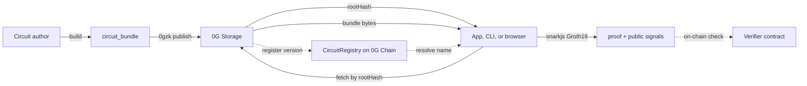

# Introduction

**0gzk** is a toolkit for shipping **zero-knowledge proofs** on top of **0G**. You write a **Circom** circuit, package the proving artifacts into a **circuit bundle**, and store that bundle on **0G Storage** as content-addressed data. From there, anyone with the **`rootHash`** can pull the same bytes back and run the prover **on their own machine or in their browser**.

The reason to use **0G** here is straightforward: proving systems produce **large binary artifacts** (compiled wasm, proving keys, verification keys) that need to be **reproducible** and **available**. **0G Storage** gives every bundle a stable content address. **0G Chain** sits next to it as an EVM where you can publish a small on-chain record so others can find your circuit by **`name@version`** instead of memorizing a hash.

Proving happens **next to the user**. Witness data (the private inputs your circuit consumes) stays on the device that calls **`generateProof`**. What leaves the device is a small **Groth16 proof** and the **public signals** you chose to expose. The same code path works from a Node script, a browser app, or the **`0gzk`** command line.

## What you actually do

A typical flow looks like this. A circuit author writes **`circuit.circom`**, runs a one-time trusted setup, and ends up with a **`circuit_bundle/`** containing **`circuit.wasm`**, **`circuit_final.zkey`**, **`verification_key.json`**, **`metadata.json`**, and a generated **`verifier.sol`**. The CLI uploads that directory to **0G Storage** and prints a **`rootHash`**:

```bash
0gzk publish ./circuit_bundle
```

An app developer then fetches the bundle and proves against it:

```ts
import { generateProof, verifyLocal } from "@0gzk/sdk";

const { proof, publicSignals } = await generateProof(bundle, inputs);
const ok = await verifyLocal(bundle, { proof, publicSignals });
```

That is the whole arc: **build, publish to 0G, fetch, prove, verify**.

## How 0G fits in

**0G Storage** is the home of the **circuit bundle**. Bundles are tarred and uploaded once; everyone fetches the exact same bytes by **`rootHash`**. The **0G indexer** finds the right storage nodes, the **SDK** unpacks the bundle into the four fields the prover needs (**`wasm`**, **`zkey`**, **`vkey`**, **`metadata`**), and the **CLI cache** at **`~/.0gzk/bundles/<rootHash>/`** keeps things fast on repeat use.

**0G Chain** is where the **`CircuitRegistry`** lives. The registry maps a human-friendly **`name`** and **`version`** to the **`rootHash`** stored on 0G Storage, along with a **`vkeyHash`** that lets clients confirm they downloaded the right verification key. The registry is an EVM contract; you can deploy your own verifier next to it and gate on-chain actions with **`IGroth16Verifier.verifyProof`** when your product calls for it.

The two layers are independent. **0G Storage** is the source of truth for bytes; **0G Chain** is the source of truth for names and proofs that other smart contracts can trust.

## Roles in a 0gzk project

### Circuit authors

You design the circuit, run the trusted setup, and decide what **`metadata.json`** says about expected inputs. After you build the **`circuit_bundle/`**, **`0gzk publish`** sends it to **0G Storage**; **`0gzk publish --register`** adds a record on **0G Chain** so other people can discover the circuit by name. **[Example 05: Publish your circuit](/examples/05-publish-your-own)** walks the full author journey.

### App and backend developers

You consume bundles authored by others (or by your own team) and turn user inputs into proofs. In Node you can pull a bundle with **`fetchBundle`** from **`@0gzk/sdk/node`**; in the browser you fetch parts of the bundle over HTTPS and pass them to **`generateProof`** from **`@0gzk/sdk`**. **`validateInputs`** uses **`metadata.json`** so bad inputs fail fast before the WASM prover runs. **[Example 01: Prove in Node](/examples/01-prove-in-node)** and **[Example 02: Prove in browser](/examples/02-prove-in-browser)** are the shortest reference projects.

### Smart contract integrators

When proofs gate state changes, you wire **`IGroth16Verifier`** into your contracts and submit **`proof.json`** plus **`public.json`** as calldata. **`CircuitRegistry`** lets your contracts (or your dapp) look up the canonical **`vkeyHash`** for a given **`name@version`** so you can refuse stale or rogue verifiers. **[Example 03: Verify on-chain](/examples/03-verify-on-chain)** shows the Solidity side; the **[Contracts](/contracts)** page lists deployed registry addresses for mainnet and the Galileo testnet.

## End-to-end picture



Solid arrows are the path every project follows: **build, store on 0G, fetch, prove**. Dashed arrows show the registry and on-chain verifier paths you opt into when your product needs them.

## Glossary

| Term | Meaning |
| --- | --- |
| **0G Storage** | Decentralized storage used for content-addressed circuit bundles; reached through **`@0gfoundation/0g-ts-sdk`**. |
| **0G Chain** | EVM chain hosting **`CircuitRegistry`** and any Groth16 verifier contracts you deploy. |
| **Circuit bundle** | The folder (or tar) with **`circuit.wasm`**, **`circuit_final.zkey`**, **`verification_key.json`**, **`metadata.json`**, and usually **`verifier.sol`**. |
| **rootHash** | Identifier returned by **0G Storage** after upload; the handle clients use with **`fetchBundle`** or **`0gzk fetch`**. |
| **vkeyHash** | **`keccak256`** of the canonical **`verification_key.json`**; used to confirm a downloaded bundle matches its registry record. |
| **CircuitRegistry** | On-chain index mapping **`name`** and **`version`** to **`rootHash`**, **`vkeyHash`**, optional verifier address, and metadata URI. |
| **Groth16** | The SNARK scheme used here through **snarkjs**. |
| **Witness** | Private and public inputs fed into the circuit during proving. |

## Next steps

Set up your environment in **[Getting started](/getting-started)**, then pick a path:

- **[CLI](/cli)** for shell workflows like **`0gzk publish`** and **`0gzk prove`**.
- **[SDK](/sdk)** for TypeScript integration in apps.
- **[Contracts](/contracts)** for the on-chain interfaces and deployed addresses.
- **[Examples](/examples)** for five short reference projects, one per integration style.
- **[Reference](/reference)** for the shared types and error classes used across every SDK page.
