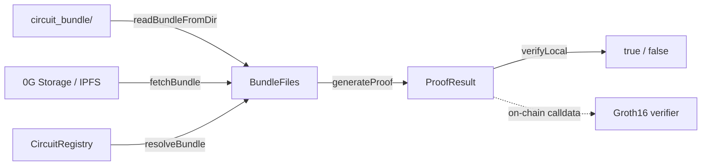

# SDK overview

**`@0gzk/sdk`** is published as **four primary subpath exports** plus three convenience re-exports. Pick the **smallest** surface that fits the runtime you target; that keeps browser bundles tight and your peer-dep footprint honest.

## Subpath map

| Import | Runs in | What you get |
| --- | --- | --- |
| **`@0gzk/sdk`** | Node **and** browser | **`generateProof`**, **`verifyLocal`**, **`validateInputs`**, **`InputValidationError`**, **`BN128_FIELD_MODULUS`**, the network presets (**`NETWORKS`**, **`resolveNetwork`**, **`networkForChainId`**, **`explorerTxUrl`**, **`explorerAddressUrl`**), the bundle-ref codec (**`parseBundleRef`**, **`backendForRef`**, **`formatBundleUri`**, **`cidToRootHash`**, **`rootHashToCidV0`**), and all the shared types (**`BundleFiles`**, **`CircuitMetadata`**, **`InputSpec`**, **`ProofResult`**, ...). |
| **`@0gzk/sdk/node`** | Node only | **`loadConfig`**, **`requireSigningConfig`**, **`readBundleFromDir`**, **`fetchBundle`**, **`uploadBundle`**, **`UploadTimeoutError`**, the storage backends (**`ZeroGStorageBackend`**, **`IpfsStorageBackend`**, **`createStorageBackend`**), plus re-exports of the network presets and bundle-ref helpers. |
| **`@0gzk/sdk/onchain`** | Node **and** browser | **`getRegistryContract`**, **`REGISTRY_ADDRESSES`**, **`getRegistryAddress`**, **`getVersion`**, **`getLatest`**, **`listCircuits`**, **`listVersions`**, **`resolveBundle`**, **`parseNameSpec`**, **`CIRCUIT_REGISTRY_ABI`**. |
| **`@0gzk/sdk/build`** | Node only | **`buildCircuitBundle`** plus every primitive (**`fetchPowersOfTau`**, **`setupGroth16`**, **`assembleBundle`**, **`hashVkey`**, **`canonicalJSON`**, **`blake2b512File`**, **`PTAU_BLAKE2B`**, **`PtauIntegrityError`**, ...). |

### Secondary entries

These exist for ultra-narrow imports (mostly relevant to tree-shaking and tooling that resolves single-file modules):

| Import | Equivalent to |
| --- | --- |
| **`@0gzk/sdk/prover`** | **`generateProof`** + **`verifyLocal`** + **`ProofResult`**. |
| **`@0gzk/sdk/inputs`** | **`validateInputs`** + **`InputValidationError`** + **`BN128_FIELD_MODULUS`** + **`ValidatedScalar`** / **`ValidatedValue`** / **`ValidatedInputs`**. |
| **`@0gzk/sdk/types`** | The pure types: **`BundleFiles`**, **`CircuitMetadata`**, **`InputSpec`**, **`OutputSpec`**, **`InputVisibility`**. |

The root **`@0gzk/sdk`** already re-exports everything in this table; reach for the subpaths only when bundle size or dependency hygiene actually matters.

## Peer dependencies

| Package | Required by | Notes |
| --- | --- | --- |
| **`snarkjs`** | **`@0gzk/sdk`**, **`@0gzk/sdk/build`** | Required peer. **`generateProof`**, **`verifyLocal`**, and **`setupGroth16`** all call into it. Pin to **`^0.7.5`**. |
| **`@0gfoundation/0g-ts-sdk`** | **`@0gzk/sdk/node`** | Optional peer, **lazily imported**: only loaded when the **`0g`** storage backend is actually used. Required for 0G Storage uploads/fetches; IPFS-only consumers (e.g. Base users) can skip it entirely. Pin to **`^1.2.4`**. |
| **`ethers`** | **`@0gzk/sdk/onchain`**, **`@0gzk/sdk/build`** (via **`hashVkey`**) | Marked optional but required for the registry helpers and **`vkeyHash`** computation. Pin to **`^6.13.0`**. |

The root entry has **no** **`@0gfoundation/0g-ts-sdk`** or **`ethers`** dependency, so a browser bundle that only proves can ship those bytes alone.

## Mental model



Every flow ends in **`BundleFiles`** before the prover runs. **`@0gzk/sdk/onchain`** turns a **`name@version`** into a record; **`@0gzk/sdk/node`** turns a bundle reference (a **`rootHash`**, an **`ipfs://` CID**, or a **`0g://` URI**) into bytes; **`@0gzk/sdk/build`** turns a **`.circom`** file into a bundle in the first place. The proving and verification calls themselves live in **`@0gzk/sdk`** and never touch the network.

## ESM only

The package is **`"type": "module"`**. From CommonJS code you need a dynamic import:

```javascript
const { generateProof } = await import("@0gzk/sdk");
```

Node 20+ and the latest Vite / Next.js / esbuild handle the ESM exports natively.

## Pages in this section

- **[Core (`@0gzk/sdk`)](/sdk/core)**: prove, verify, validate inputs.
- **[Node (`@0gzk/sdk/node`)](/sdk/node)**: configuration, **`fetchBundle`**, **`uploadBundle`**.
- **[On-chain (`@0gzk/sdk/onchain`)](/sdk/onchain)**: registry helpers and name resolution.
- **[Build (`@0gzk/sdk/build`)](/sdk/build)**: Powers of Tau, Groth16 setup, bundle assembly.
- **[Reference](/reference)**: shared types and error classes (linked from every page above).
