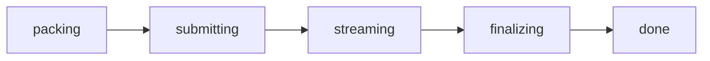

# Node: `@0gzk/sdk/node`

This subpath is **Node only**. It uses **`node:fs`**, **`node:path`**, and **`tar`** to read bundles off disk, and talks to **0G Storage** or an **IPFS pinning service / gateway** depending on the configured backend. **`@0gfoundation/0g-ts-sdk`** and **`ethers`** are imported **lazily** — they only load when the `0g` backend is actually used, so IPFS-only consumers never need them installed. Do not import this subpath from browser code.

See **[Reference](/reference)** for the shapes of **`BundleFiles`**, **`UploadStage`**, **`UploadProgress`**, **`UploadResult`**, and **`UploadTimeoutError`**, and **[Networks & storage](/networks)** for the full chain and backend matrix.

## Configuration

### `Network`, `NetworkPreset`, `NETWORKS`

```typescript
type Network = "0g-mainnet" | "0g-testnet" | "base" | "base-sepolia";

interface NetworkPreset {
  chainId: number;
  family: "0g" | "evm";
  rpcUrl: string;
  explorer: string;
  explorerTxPath?: string;
  explorerAddressPath?: string;
  indexerUrl?: string; // only on family: "0g" chains
}

const NETWORKS: Record<Network, NetworkPreset>;
```

The baked-in presets (chain IDs, RPCs, explorers, indexers) live on the **[Networks & storage](/networks#supported-networks)** page. The deprecated aliases **`mainnet`** / **`testnet`** still resolve to the 0G chains via **`resolveNetwork`**; unknown names make **`loadConfig`** **throw** with the valid list. These symbols (plus **`NETWORK_ALIASES`**, **`NETWORK_NAMES`**, **`resolveNetwork`**, **`networkForChainId`**, **`explorerTxUrl`**, **`explorerAddressUrl`**) are isomorphic and also exported from the **`@0gzk/sdk`** root — see **[SDK → core](/sdk/core#networks-and-chain-presets)**.

### `StorageConfig`

```typescript
type StorageBackendId = "0g" | "ipfs";
type ZeroGNetwork = "0g-mainnet" | "0g-testnet";

interface IpfsConfig {
  apiUrl: string;    // pinFileToIPFS-compatible upload endpoint
  apiToken?: string; // Bearer token; only needed to publish
  gateway: string;   // public HTTP gateway used for fetches
}

interface StorageConfig {
  network: Network;        // registry chain
  chainId: number;
  rpcUrl: string;          // registry-chain RPC
  explorer: string;
  indexerUrl: string;      // 0G Storage indexer (used only when storage is "0g")
  privateKey?: string;
  storage: StorageBackendId;      // which backend holds bundle tarballs
  storageNetwork: ZeroGNetwork;   // 0G chain the 0g backend signs uploads on
  ipfs: IpfsConfig;
}
```

The full config object. The name predates multi-chain support: it carries both the **registry-chain** settings (`network`/`chainId`/`rpcUrl`/`explorer`) and the **storage-backend** settings (`storage`/`storageNetwork`/`indexerUrl`/`ipfs`). Every function in this module either takes a **`StorageConfig`** or a subset of it (**`fetchBundle`** only strictly needs **`indexerUrl`**, for instance).

### `loadConfig`

```typescript
function loadConfig(overrides?: Partial<StorageConfig>): StorageConfig;
```

Merges **`overrides`** with environment variables, falling back to network presets. The resolution order for each field is **explicit override -> generic `OGZK_*` env -> legacy `OG_*` env -> preset / built-in default**.

| Field | Env vars (first wins) | Default |
| --- | --- | --- |
| **`network`** | **`OGZK_NETWORK`**, **`OG_NETWORK`** (canonical name or alias; unknown values **throw**) | **`0g-mainnet`** |
| **`rpcUrl`** | **`OGZK_RPC_URL`**, **`OG_RPC_URL`** | preset RPC for **`network`** |
| **`indexerUrl`** | **`OG_INDEXER_URL`** | preset indexer for **`storageNetwork`** |
| **`privateKey`** | **`OGZK_PRIVATE_KEY`**, **`OG_PRIVATE_KEY`** | **`undefined`** |
| **`storage`** | **`OGZK_STORAGE`** (**`0g`** or **`ipfs`**) | **`0g`** on 0G chains, **`ipfs`** on other chains |
| **`storageNetwork`** | **`OGZK_STORAGE_NETWORK`** (must be a 0G chain, else **throws**) | the selected network when it is 0G-family, else **`0g-mainnet`** |
| **`ipfs.apiUrl`** | **`OGZK_IPFS_API_URL`** | **`https://api.pinata.cloud/pinning/pinFileToIPFS`** |
| **`ipfs.apiToken`** | **`OGZK_IPFS_API_TOKEN`** | **`undefined`** |
| **`ipfs.gateway`** | **`OGZK_IPFS_GATEWAY`** | **`https://ipfs.io`** |
| **`chainId`** | (not read from env) | preset **`chainId`** |
| **`explorer`** | (not read from env) | preset **`explorer`** |

```typescript
import { loadConfig } from "@0gzk/sdk/node";

const config = loadConfig();                             // env-only (0g-mainnet default)
const testnet = loadConfig({ network: "0g-testnet" });   // force 0G Galileo
const base = loadConfig({ network: "base-sepolia" });    // storage defaults to "ipfs"
const explicit = loadConfig({
  rpcUrl: "https://my-private-rpc.example",
  privateKey: process.env.MY_KEY,
});
```

### `requireSigningConfig`

```typescript
function requireSigningConfig(
  config: StorageConfig,
): asserts config is StorageConfig & { privateKey: string };
```

TypeScript assertion helper. The `0g` backend's **`uploadBundle`** path calls it for you; you only need it if you build a thin wrapper that fails fast when no signing key is configured.

```typescript
import { loadConfig, requireSigningConfig } from "@0gzk/sdk/node";

const config = loadConfig();
requireSigningConfig(config);
// config.privateKey is now typed as `string`.
```

Throws **`Error("Missing private key. Set OGZK_PRIVATE_KEY (or legacy OG_PRIVATE_KEY) ...")`** when no key is found.

## Reading bundles

### `readBundleFromDir`

```typescript
function readBundleFromDir(bundleDir: string): Promise<BundleFiles>;
```

Reads **`metadata.json`**, parses it, then loads each file referenced in **`metadata.files`** (wasm/zkey as bytes, vkey as parsed JSON). If **`metadata.files.verifier`** is set and the file exists, the Solidity source is returned as **`verifier`**.

```typescript
import { readBundleFromDir } from "@0gzk/sdk/node";
import { generateProof } from "@0gzk/sdk";

const bundle = await readBundleFromDir("./circuit_bundle");
const proof = await generateProof(bundle, { x: 3, y: 5 });
```

Throws **`SyntaxError`** on malformed **`metadata.json`** and the usual **`ENOENT`** if any referenced file is missing.

### `fetchBundle`

```typescript
function fetchBundle(
  ref: string,
  config: Pick<StorageConfig, "indexerUrl"> &
    Partial<Pick<StorageConfig, "storage" | "storageNetwork" | "network" | "rpcUrl" | "ipfs">>,
  outputDir?: string,
): Promise<BundleFiles>;
```

Downloads **`bundle.tar.gz`** from the right backend, extracts it into **`outputDir`** (or a fresh OS temp directory when omitted), and returns the same shape as **`readBundleFromDir`**. **`ref`** may be:

| `ref` form | Backend |
| --- | --- |
| bare **`0x...`** root hash | **`config.storage`** (default **`0g`** — the pre-0.4.0 behavior) |
| **`ipfs://<cid>`** or bare **`Qm...`** CID | IPFS, via **`config.ipfs.gateway`** |
| **`0g://0x...`** | 0G Storage |

```typescript
import { fetchBundle, loadConfig } from "@0gzk/sdk/node";

const config = loadConfig();

// Default: extract to an OS temp dir (good for one-shot scripts).
const bundle = await fetchBundle("0xabc...", { indexerUrl: config.indexerUrl });

// IPFS-hosted bundle (no indexer involved; gateway defaults to https://ipfs.io).
const pinned = await fetchBundle("ipfs://QmS4us...", config);

// Or: pin to a cache directory so repeat fetches are essentially free.
const cached = await fetchBundle(
  "0xabc...",
  { indexerUrl: config.indexerUrl },
  `/tmp/0gzk/${"0xabc..."}`,
);
```

The third argument is plain "where do you want the tarball extracted"; **`fetchBundle`** does **not** check for an existing **`metadata.json`** there (the CLI handles caching at a higher level via **`OGZK_CACHE_DIR`**). Throws **`Error("0G download failed: ...")`** when the indexer rejects the request, or an HTTP error when the IPFS gateway does. No wallet or token is needed on either backend to fetch.

## Uploading bundles

### `UploadOptions`

```typescript
interface UploadOptions {
  timeoutMs?: number;                          // default: 5 * 60_000 (5 minutes)
  onProgress?: (progress: UploadProgress) => void;
}
```

**`timeoutMs`** is the wall-clock budget; non-finite values or **`<= 0`** disable the timer entirely (the upload still runs). Errors thrown inside **`onProgress`** are swallowed defensively so a buggy logger cannot tear down an upload.

### `uploadBundle`

```typescript
function uploadBundle(
  bundleDir: string,
  config: StorageConfig,
  options?: UploadOptions,
): Promise<UploadResult>;
```

Uploads via the backend selected by **`config.storage`** (a **`StorageBackend`** under the hood; **`createStorageBackend`**, **`ZeroGStorageBackend`**, and **`IpfsStorageBackend`** are exported for direct use). Required bundle files (asserted before any network work): **`metadata.json`**, **`circuit.wasm`**, **`circuit_final.zkey`**, **`verification_key.json`**. Any other loose files (a **`verifier.sol`**, for example) are bundled too; an existing **`bundle.tar.gz`** at the top level is ignored.

- **`0g`** backend: packs a gzip tarball into an OS temp dir, computes the Merkle tree to derive **`rootHash`** locally, then submits via **`Indexer.upload`** — signing on the chain named by **`config.storageNetwork`** with a wallet built from **`config.privateKey`**. Requires a funded key (**`requireSigningConfig`**). It restores **`console.log`** / **`console.error`** in **`finally`**.
- **`ipfs`** backend: packs the same tarball and POSTs it to **`config.ipfs.apiUrl`** with **`Authorization: Bearer <apiToken>`** and **`cidVersion: 0`**. **`rootHash`** is the CIDv0's sha2-256 digest. No wallet, no gas — throws if **`config.ipfs.apiToken`** is unset.

The result carries the scheme-prefixed bundle **`uri`** (**`0g://0x...`** or **`ipfs://Qm...`**) and the **`backend`** id; **`txHash`** / **`txSeq`** / **`finalized`** are **0G-only and optional** (this is the one breaking type change in 0.4.0 — see **[Reference](/reference#uploadstage-uploadprogress-uploadresult)**).

```typescript
import { uploadBundle, loadConfig, UploadTimeoutError } from "@0gzk/sdk/node";

const config = loadConfig({ network: "0g-testnet" });

try {
  const result = await uploadBundle("./circuit_bundle", config, {
    timeoutMs: 10 * 60_000,
    onProgress: (p) => {
      console.log(`[${p.stage}] ${p.message}`);
      if (p.uploadedSegments && p.totalSegments) {
        const pct = ((p.uploadedSegments / p.totalSegments) * 100).toFixed(1);
        console.log(`  ${pct}%`);
      }
    },
  });

  console.log("rootHash:", result.rootHash);
  console.log("uri:     ", result.uri);      // "0g://0x..." | "ipfs://Qm..."
  console.log("txHash:  ", result.txHash);   // undefined on the ipfs backend
} catch (err) {
  if (err instanceof UploadTimeoutError && err.rootHash) {
    console.warn("upload still finalizing; rootHash already known:", err.rootHash);
  } else {
    throw err;
  }
}
```

Throws:

- **`Error`** from **`requireSigningConfig`** when **`config.privateKey`** is unset (`0g` backend), or **`Error("Missing IPFS API token. ...")`** (`ipfs` backend).
- **`Error`** asking you to install **`@0gfoundation/0g-ts-sdk`** when the `0g` backend is used and the optional peer dependency is missing.
- **`Error("Bundle directory does not exist: <path>")`**.
- **`Error("Bundle is missing required file: <name>")`** when any of the four required files is absent.
- **`UploadTimeoutError`** when **`timeoutMs`** elapses (`0g` backend).
- **`Error("0G upload failed: ...")`** / **`Error("IPFS upload failed: ...")`** when the remote end returns an error.

### Progress flow

On the **`0g`** backend, **`uploadBundle`** intercepts the 0G TS SDK's log lines to parse them into structured **`UploadProgress`** events, walking the stages below in order:



| Stage | Carries | Meaning |
| --- | --- | --- |
| **`packing`** | **`message`** | Building the tarball locally. |
| **`submitting`** | **`message`**, **`rootHash`** | Tarball ready; submitting the upload tx (rootHash is already computed). |
| **`streaming`** | **`uploadedSegments`**, **`totalSegments`**, **`rootHash`** | Bytes being sent to storage nodes. |
| **`finalizing`** | **`rootHash`** | Storage nodes are finalizing the file; this is the long part. |
| **`done`** | **`rootHash`**, **`finalized: true`** | All set. |

The **`ipfs`** backend walks a shorter path — **`packing` -> `submitting` -> `done`** — because pinning is a single HTTP request with no asynchronous finalization.

If **`timeoutMs`** elapses during **`streaming`** or **`finalizing`**, you still get an **`UploadTimeoutError`** with a populated **`rootHash`** in most cases. That hash is your recovery handle: the data is almost certainly on chain, you just stopped waiting. You can either re-call **`uploadBundle`** later (idempotent for the same content) or jump straight to **`CircuitRegistry.publishVersion`** (the CLI does this via **`0gzk registry register <rootHash> --bundle <dir>`**).

## Bundle references

**`parseBundleRef`**, **`backendForRef`**, **`formatBundleUri`**, **`cidToRootHash`**, **`rootHashToCidV0`**, and **`isRootHash`** are re-exported here for convenience; they are isomorphic and documented on **[SDK → core](/sdk/core#bundle-references)**. The typical Node use is routing a registry record to the right backend:

```typescript
import { fetchBundle, parseBundleRef, loadConfig } from "@0gzk/sdk/node";

const ref = parseBundleRef(record); // { backend: "0g" | "ipfs", ref: "0x..." | "Qm..." }
const bundle = await fetchBundle(
  ref.backend === "ipfs" ? `ipfs://${ref.ref}` : ref.ref,
  loadConfig(),
);
```

## What's not exported

**`packages/sdk/src/node/upload-internals.ts`** contains helpers like **`parseUploadLogLine`** and **`withTimeout`**. They are used by tests and are intentionally not re-exported. Treat them as private.
